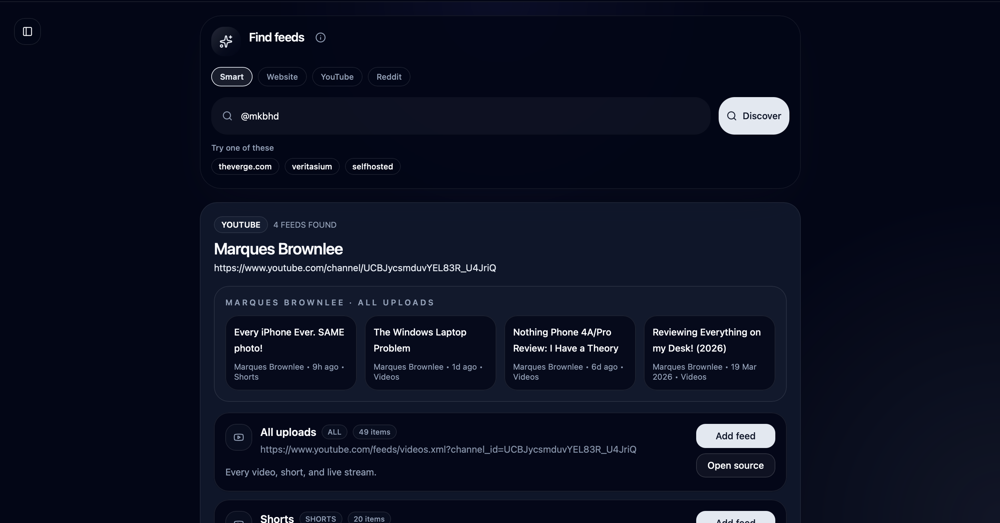
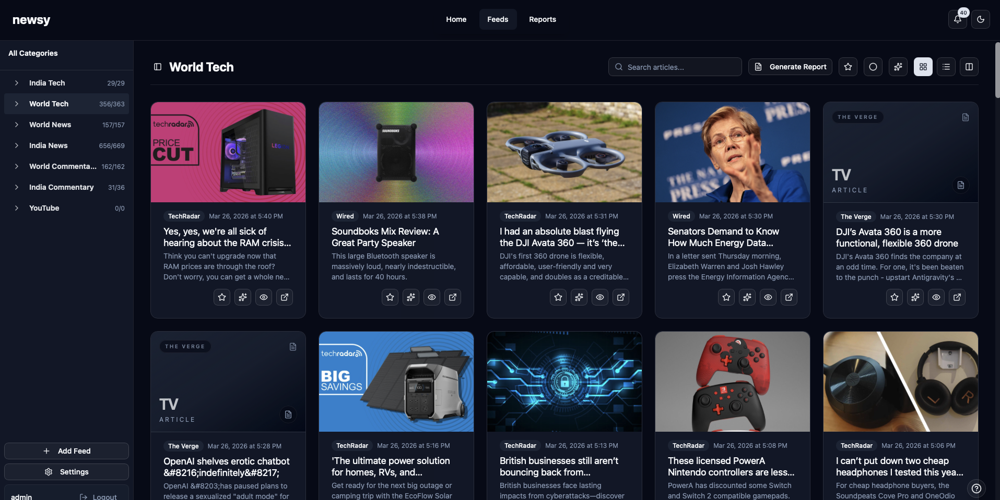
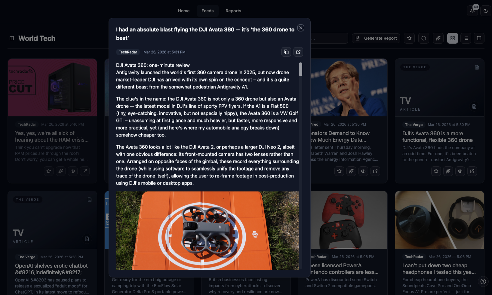
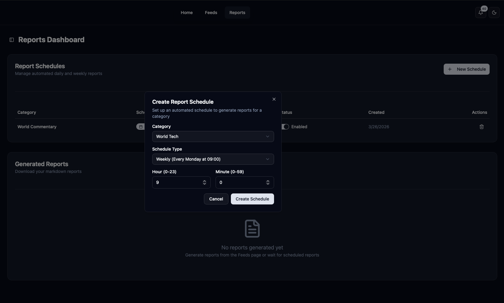
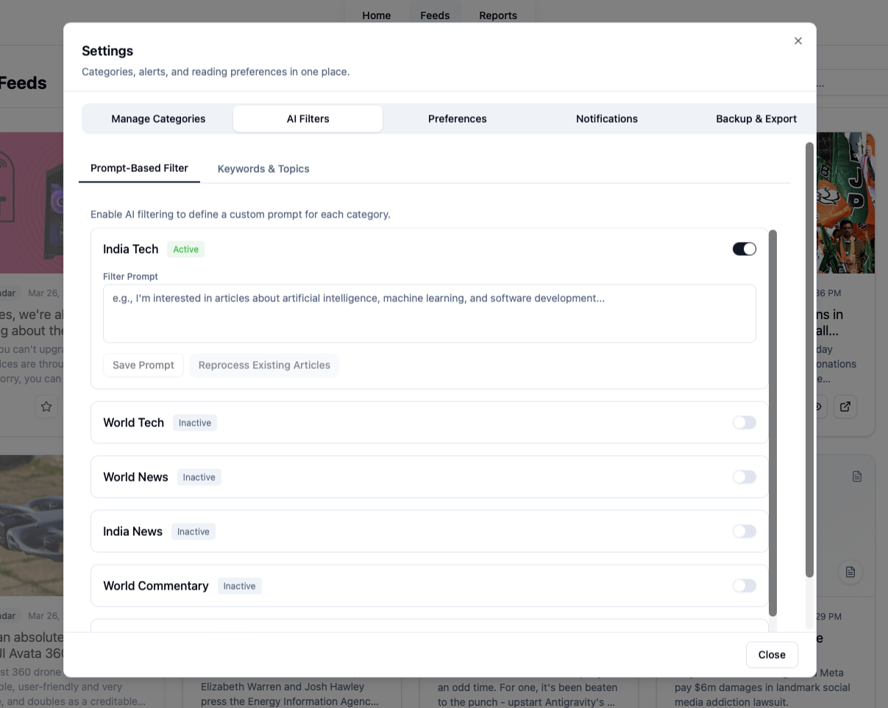
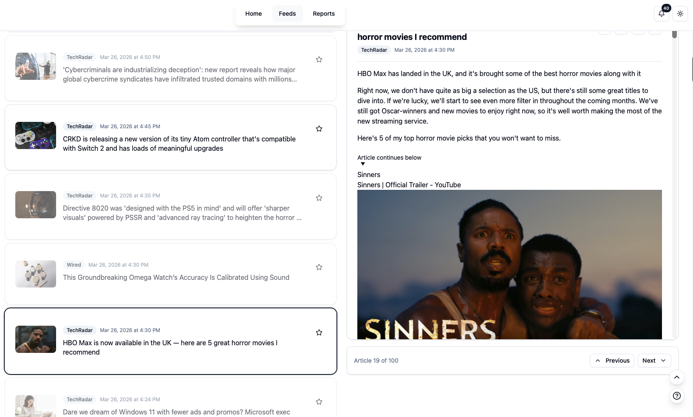
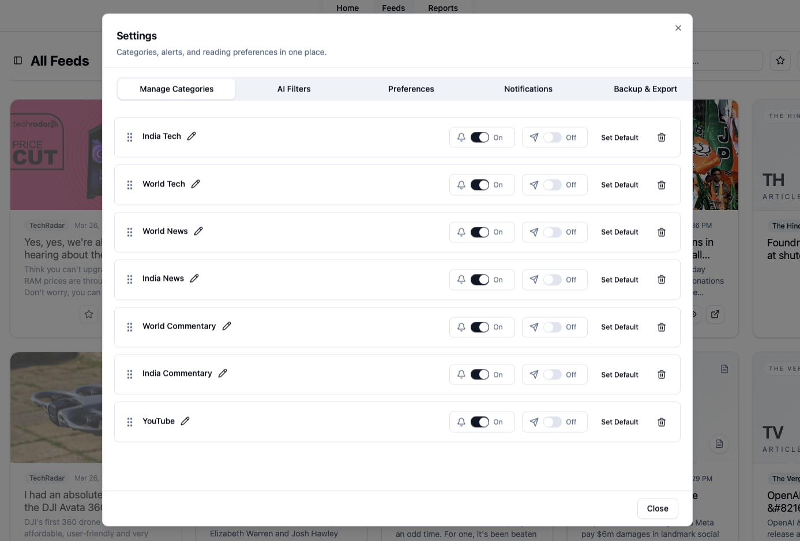

# Newsy

**Stack:** SvelteKit, FastAPI, PostgreSQL, Redis, Go, Docker

**Default Docker layout:** 3 containers — `newsy-app`, `go-scheduler`, and `newsy_db`

**Core libraries:** OpenAI SDK, RapidFuzz, feedparser, readability-lxml

Newsy is a self-hosted news app for people who follow many sources and want a clean, reliable way to stay updated. It brings feeds, categories, saved reading, reports, and notifications into one place, backed by a lightweight Go scheduler designed to handle large feed sets efficiently.

## New: Feed Discovery

Newsy can now discover feeds directly from the app using a bundled discovery service included in this repo.

- Search **websites**, **YouTube**, and **Reddit** from one bar
- Preview recent items before adding a source
- Add discovered feeds into your existing categories in a few clicks

<p align="center">
  
</p>

<p align="center"><sub>Discover feeds from websites, YouTube channels, and subreddits without leaving Home.</sub></p>

## What it solves

Most feed workflows become hard to manage over time. Sources multiply, important stories get buried, and tools are split across too many apps.

Newsy gives you a practical workflow in one system. You add sources once, organize by category, filter and summarize with AI, save key stories, schedule reports, and deliver alerts where you want them. You keep full control of your data and infrastructure.

## Features

- **Multiple reading layouts**: switch between card, headline, and column views.
- **Feed discovery from Home**: search websites, YouTube, and Reddit, preview results, and add feeds quickly.
- **Category-based organization**: manage feeds and alerts by category.
- **Unread, search, and saved queue**: keep track of what to read now and what to revisit later.
- **Built-in reader for articles and videos**: read full content and watch embedded videos inside Newsy.
- **Progressive Web App**: install Newsy for a more app-like reading experience on desktop and mobile.
- **Efficient feed polling at scale**: the Go scheduler is built to handle large feed sets with low resource usage.
- **AI filtering and summaries**: use OpenAI-compatible APIs to reduce noise.
- **Keyboard shortcuts**: navigate faster across feeds and reading views.
- **Scheduled Markdown reports**: generate starred, daily, and weekly reports.
- **Browser push and Telegram alerts**: control notifications at category level.
- **Backup and OPML support**: backup/restore plus import/export for portability.

## Screenshots

<p align="center">
  
  
</p>

<p align="center">
  
  
</p>

<p align="center">
  
  
</p>

<p align="center">
  
</p>

<p align="center"><sub>Feed view, built-in reader, report scheduler, AI filtering, column view, category management, and mobile PWA.</sub></p>

## Setup

### Prerequisites

- Docker
- Docker Compose

### 1. Create your environment file

```bash
cp .env.example .env
```

### 2. Generate required secrets

Before running in production, set strong values for:

- `AUTH_SECRET_KEY`
- `INTERNAL_API_KEY`

For local testing, placeholder values are acceptable. For production deployments, use secure random values in `.env`.

### 3. Generate Web Push keys

Web Push is optional, but if you want browser notifications you need VAPID keys.

```bash
npx web-push generate-vapid-keys
```

Add the generated values to:

```env
WEB_PUSH_VAPID_PUBLIC_KEY=...
WEB_PUSH_VAPID_PRIVATE_KEY=...
WEB_PUSH_SUBJECT=mailto:you@example.com
```

### 4. Review important environment values

At minimum, check these:

```env
PUBLIC_URL=https://your-domain.example
CORS_ORIGINS=https://your-domain.example,http://localhost:3456,http://127.0.0.1:3456
AUTH_SECRET_KEY=replace-me
INTERNAL_API_KEY=replace-me
FEED_DISCOVERY_API_BASE_URL=http://127.0.0.1:3460
FEED_DISCOVERY_HOST_PORT=3460
WEB_PUSH_VAPID_PUBLIC_KEY=replace-me-if-using-push
WEB_PUSH_VAPID_PRIVATE_KEY=replace-me-if-using-push
WEB_PUSH_SUBJECT=mailto:you@example.com
OPENAI_API_KEY=replace-me-if-using-ai
TELEGRAM_BOT_TOKEN=replace-me-if-using-telegram
```

Notes:

- `PUBLIC_URL` should match the URL users will actually open.
- `FEED_DISCOVERY_API_BASE_URL` already points to the bundled feed discovery service running inside the main app container.
- `FEED_DISCOVERY_HOST_PORT` controls the optional host port for opening the discovery service directly.
- AI features are optional, but require an OpenAI-compatible API.
- Telegram notifications are optional, but require a bot token.
- On first run, create the initial admin account through the bootstrap flow.

### 5. Start the application

```bash
docker compose up -d --build
```

Open:

```text
http://localhost:3456
```

## Web Push and HTTPS

Browser push works only on a **secure origin**:

- `https://your-domain.example`
- or `http://localhost` for local testing

It will **not** work over plain HTTP on a LAN IP such as:

```text
http://192.168.1.50:3456
```

If you want Web Push outside localhost, put Newsy behind HTTPS. Good options include:

- **Cloudflare Tunnel** for quick remote HTTPS
- **Caddy** for simple automatic HTTPS
- **Nginx** or **Traefik** if you already use a reverse proxy
- any other TLS-enabled route you prefer


## Development

Start the development stack with hot reload:

```bash
docker compose -f docker-compose.dev.yml up --build
```

This runs a 3-container stack:

- `newsy-app` → frontend, backend, bundled feed discovery, and in-container Redis for cache/queue
- `go-scheduler`
- `newsy_db`

The development setup is configured to work more easily on localhost without requiring HTTPS for auth cookies.

## Contributing

Newsy is actively developed, and contributions are welcome.

If you want to contribute:

1. open an issue or discussion for larger changes
2. keep pull requests focused and easy to review
3. include clear reproduction steps for bug fixes
4. update docs when behavior changes

## License

See [LICENSE](LICENSE).
